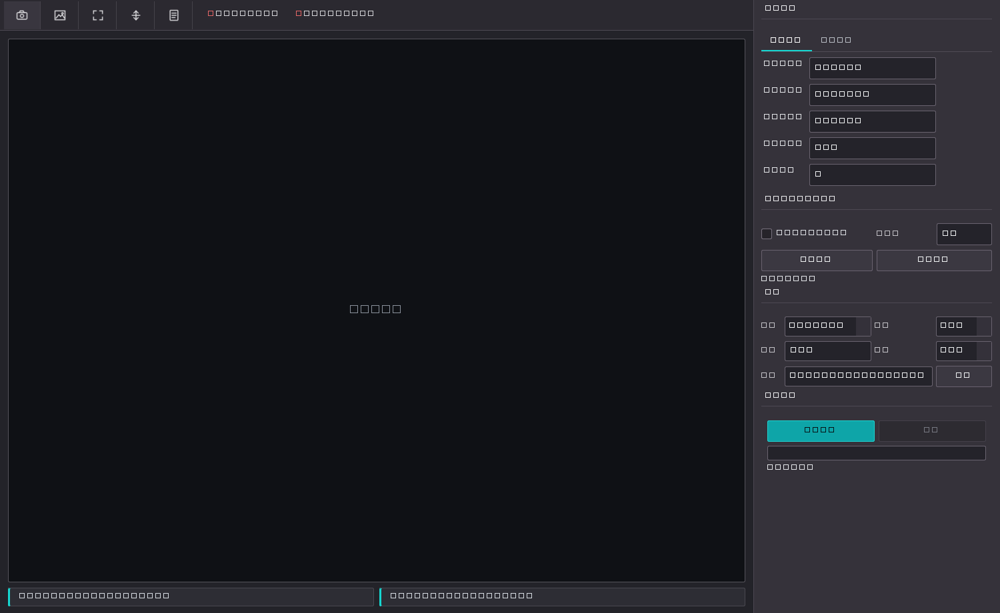

# grab

HTGE 相机 + PZT 位移台的纯 Python 采集程序，提供桌面 GUI、软触发扫描、传感器 ROI 框选、暗场/平场校正和图像保存能力，目标是替代原有 MATLAB/厂商工具流程，统一相机采集与 PZT 控制。



## 下载与安装

Windows x64 用户可从 [GitHub Releases](https://github.com/Luomou1/grab/releases/latest) 下载最新安装包。

当前版本：`v1.2.1`

```text
grab_Setup_v1.2.1.exe
SHA256: 5452595B41829554A174B12CC976EA9574A9536755FCEB67BF7D1A84796DAAFA
```

安装包已包含 Python 运行环境及华腾 SDK 核心 DLL，无需单独安装 Python。目标电脑仍需安装与相机型号匹配的华腾驱动；GigE 相机还需正确配置网卡和防火墙。

## 功能概览

- PySide6 桌面界面，集中管理相机、PZT、扫描、保存和日志。
- 华腾相机采集与预览，支持 `8bit` / `12bit packed` 输出。
- PZT 串口 / UDP 连接，按旧 GUI 逻辑发送闭环与位移控制命令。
- 传感器 ROI 框选、独立 ROI 预览与一键恢复全幅，可从预览窗口直接选择区域。
- 普通扫描 / 中心扫描两种模式，支持软触发和连续采集。
- 暗场 / 平场校正，扫描时可输出校正结果和原始图像。
- 顶部工具栏支持在线检查 GitHub Release 更新，并在应用内下载安装包启动更新。
- 纯 Python 测试，覆盖 PZT 协议、图像保存、ROI 坐标映射、扫描异步保存等关键逻辑。

## 项目结构

```text
grab/
├─ grab_app/
│  ├─ camera/      # 华腾相机控制与 mvsdk ctypes 封装
│  ├─ pzt/         # PZT 控制器与协议打包/解包
│  ├─ services/    # 扫描任务、保存队列、校正流程
│  ├─ ui/          # PySide6 主界面
│  ├─ config.py    # 默认配置与 SDK 路径
│  └─ image_io.py  # 图像保存与编号
├─ tests/          # 单元测试与无硬件回归验证
├─ docs/           # 实现记录
└─ run_app.py      # 启动入口
```

## 环境要求

- Python 3.11+
- Windows
- 华腾相机 SDK，可从默认目录加载：
  - `D:\HuaTengVision\SDK\X64`
  - `D:\HuaTengVision\SDK`
- PZT 设备串口或网络连接

安装依赖：

```powershell
python -m pip install -r requirements.txt
```

## 启动方式

```powershell
python run_app.py
```

## 打包安装包

项目提供 PyInstaller + Inno Setup 打包脚本，可生成 Windows 安装包：

```powershell
.\scripts\build_installer.ps1
```

首次打包可自动安装打包依赖：

```powershell
.\scripts\build_installer.ps1 -InstallDeps
```

输出目录：

```text
release\grab_Setup_v1.2.1.exe
```

详细说明见 [docs/打包安装包.md](docs/打包安装包.md)。

当前版本的功能、验证结果和已知限制见 [v1.2.1 发布说明](docs/发布说明-v1.2.1.md)。

## 已实现的关键约束

### PZT 协议

- 行为以旧版 `camera2\PZT_Camera_GUI.m` 为对齐基准。
- 设备地址固定为 `0x01`。
- 连接后会对 `0..2` 通道依次发送闭环命令。
- 位移范围限制为 `0..270 um`。
- 校验方式为二进制裸帧 + XOR。

### 相机采集

- 当前流程仅保留 `MONO8` 与 `MONO12_PACKED`。
- `12bit packed` 采集时会转成真实 `0..4095` 灰度值，再按 16bit 容器保存。
- 软触发扫描会等待采集计数递增，避免误保存上一位置缓存帧。
- 传感器 ROI 使用独立预览面板，并在相机侧按 8 像素步进对齐。

### 扫描线程模型

- UI 线程负责交互与状态显示。
- 相机后台线程持续拉取最新帧。
- 扫描线程负责 PZT 移动、等待稳定、取图与保存。

## 验证

无硬件时，可先运行以下命令确认基础结构与核心逻辑：

```powershell
python -m compileall grab_app
python -m pytest tests
```

已知说明：

- 没有相机或 PZT 设备时，连接失败属于预期现象。
- 真实联调仍需要硬件环境验证预览帧率、软触发时序和 PZT 实际位移读回。

## 后续硬件验证建议

- 相机枚举、连续预览与 ROI 生效情况。
- 软触发模式下每一步图像是否对应新的采集帧。
- PZT 串口 / UDP 实机连接、闭环命令下发与位移读回。
- 长序列扫描时的保存稳定性与吞吐表现。
